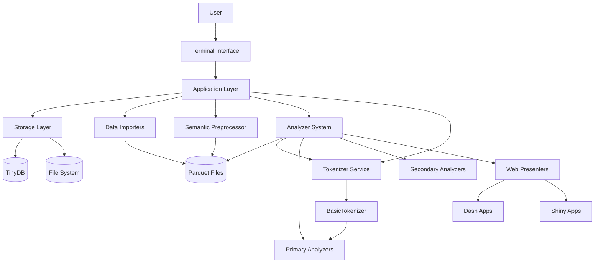
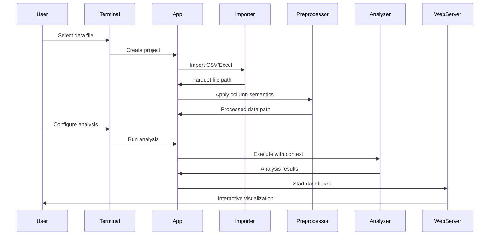

# Architecture Overview

## High-Level Component Diagram



## Core Abstractions

### Application Layer (`app/`)

Central orchestration and workspace management

Key Classes:

- `App` - Main application controller, orchestrates all operations
- `AppContext` - Dependency injection container for application-wide services
- `ProjectContext` - Project-specific operations and column mapping
- `AnalysisContext` - Analysis execution environment and progress tracking
- `AnalysisOutputContext` - Handles analysis result management
- `AnalysisWebServerContext` - Web server lifecycle management
- `SettingsContext` - Configuration and user preferences

### View Layer (`components/`)

Terminal UI components using inquirer

Key Components:

- `ViewContext` - UI state management and terminal context
- `main_menu()` - Application entry point menu
- `splash()` - Application branding and welcome
- Menu flows: project selection, analysis creation, parameter customization
- Server management: web server lifecycle, export workflows

### Model Layer (`storage/`)

Data persistence and state management

Key Classes:

- `Storage` - Main storage controller, manages projects and analyses
- `ProjectModel` - Project metadata and configuration
- `AnalysisModel` - Analysis metadata, parameters, and state
- `SettingsModel` - User preferences and application settings
- `FileSelectionState` - File picker state management
- `TableStats` - Data statistics and preview information

### Service Layer (`services/`)

Reusable services that support analyzers and data processing

Key Services:

- **Tokenizer Service** (`services/tokenizer/`) - Unicode-aware scriptio continua tokenization
  - `AbstractTokenizer` - Base interface for tokenizer implementations
  - `TokenizerConfig` - Configuration for tokenization behavior
  - `BasicTokenizer` - Core implementation with character-level and word-level tokenization
  - Character-level: CJK, Thai, Lao, Myanmar, Khmer scripts
  - Word-level: Latin, Arabic scripts with space separation
  - `TokenType`, `LanguageFamily` - Type definitions for tokenization
  - Comprehensive regex patterns and social media entity preservation
  - API contract:
    - `tokenize(text: str, lang: LanguageFamily | None = None, *, preserve_entities: bool = True) -> list[Token] | Iterator[Token]`
    - Thread-safe, stateless; may return an iterator for streaming large inputs.
  - Token model:
    - `Token { text: str, type: TokenType, start: int, end: int, script: str | None, norm: str | None }`
    - Offsets are codepoint indices; guarantee grapheme-cluster boundaries (respect ZWJ/emoji sequences).
  - Normalization:
    - Apply NFC by default; configurable NFKC for compatibility when requested; never alter preserved entities.
  - Language handling:
    - If `lang` is None, infer via Unicode Script with overrides for mixed-script; Arabic note: handle proclitics/enclitics, not just spaces.
  - Social media entity precedence:
    - Detect URL (RFC 3986), @mentions, #hashtags before general tokenization; entities are single, atomic tokens.
  - Regex safety:
    - Precompile all patterns; avoid catastrophic backtracking; enforce per-call max steps/timeout or fallback to simpler patterns.
  - Error and config semantics:
    - Invalid config ⇒ explicit exception; defaults sourced from `SettingsContext` with per-analyzer overrides in `AnalysisContext`.
  - Performance:
    - Optional caching of per-script patterns; zero-copy slicing where possible; streaming mode for texts > N chars (configurable).

## Data Flow Architecture

### Import → Analysis → Export Pipeline



### Context-Based Dependency Injection

Each layer receives context objects containing exactly what it needs:

```python
# Analyzer Context Pattern
class AnalysisContext:
    input_path: Path           # Input parquet file
    output_path: Path          # Where to write results
    preprocessing: Callable    # Column mapping function
    progress_callback: Callable # Progress reporting
    parameters: dict           # User-configured parameters

class AnalysisWebServerContext:
    primary_output_path: Path
    secondary_output_paths: list[Path]
    dash_app: dash.Dash        # For dashboard creation
    server_config: dict
```

## Core Domain Patterns

### Analyzer Interface System

Declarative analysis definition

```python
# interface.py
interface = AnalyzerInterface(
    input=AnalyzerInput(
        columns=[
            AnalyzerInputColumn(
                name="author_id",
                semantic_type=ColumnSemantic.USER_ID,
                required=True
            )
        ]
    ),
    outputs=[
        AnalyzerOutput(
            name="hashtag_analysis",
            columns=[...],
            internal=False  # User-consumable
        )
    ],
    params=[
        AnalyzerParam(
            name="time_window",
            param_type=ParamType.TIME_BINNING,
            default="1D"
        )
    ]
)
```

### Three-Stage Analysis Pipeline

1. **Primary Analyzers** - Raw data processing
   - Input: Preprocessed parquet files
   - Output: Normalized analysis results
   - Examples: hashtag extraction, n-gram generation, temporal aggregation

2. **Secondary Analyzers** - Result transformation
   - Input: Primary analyzer outputs
   - Output: User-friendly reports and summaries
   - Examples: statistics calculation, trend analysis

3. **Web Presenters** - Interactive visualization
   - Input: Primary + secondary outputs
   - Output: Dash/Shiny web applications
   - Examples: interactive charts, data exploration interfaces

## Integration Points

### External Data Sources

- **CSV Importer**: Handles delimiter detection, encoding issues
- **Excel Importer**: Multi-sheet support, data type inference
- **File System**: Project directory structure, workspace management

### Web Framework Integration

- **Dash Integration**: Plotly-based interactive dashboards
- **Shiny Integration**: Modern Python web UI framework
- **Server Management**: Background process handling, port management

### Export Capabilities

- **XLSX Export**: Formatted Excel files with multiple sheets
- **CSV Export**: Standard comma-separated values
- **Parquet Export**: Native format for data interchange

## Key Architectural Decisions

### Parquet-Centric Data Flow

- All analysis data stored as Parquet files
- Enables efficient columnar operations with Polars
- Provides schema validation and compression
- Facilitates data sharing between analysis stages

### Context Pattern for Decoupling

- Eliminates direct dependencies between layers
- Enables testing with mock contexts
- Allows analyzer development without application knowledge
- Supports different execution environments (CLI, web, testing)

### Domain-Driven Module Organization

- Clear boundaries between core, edge, and content domains
- Enables independent development of analyzers
- Supports plugin-like extensibility
- Facilitates maintenance and testing

### Semantic Type System

- Guides users in column selection for analyses
- Enables automatic data validation and preprocessing
- Supports analyzer input requirements
- Provides consistent UX across different data sources
