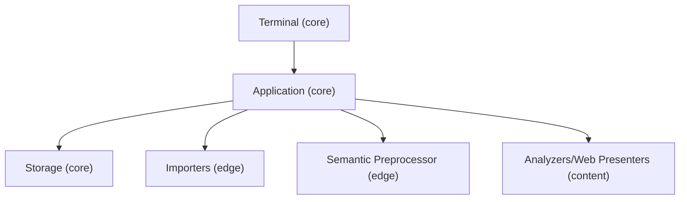
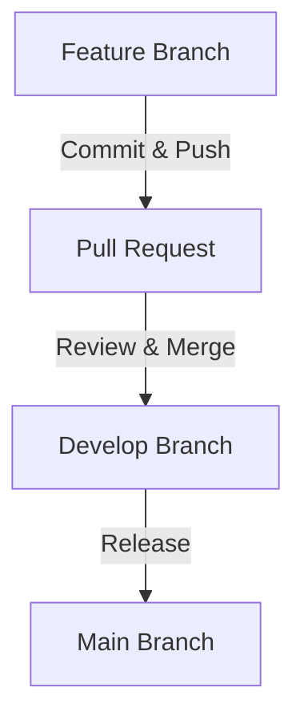

# CIB 🥭 Development Guide
Before contributing please refer to our [**Contributor Workflow**](#contributor-workflow)

## Application Design Overview
The CIB 🥭 application is a terminal-based tool for performing data analysis and visualization. It is designed to be modular and extensible, allowing developers to contribute new analysis modules and visualization components while providing a consistent user experience around data import, preprocessing, and output generation.

This design is motivated by a common pain point when moving from a data analysis script for private use to a tool that can be shared with others: A script for private consumption carries assumptions about the desired input and output data format and structure that are convenient to its author. When such a script is made available to others, debates on these aspects often arise. For a suite of analyses that this project aims to offer, if left decentralized, this debate can lead to inconsistent UX offerings across analyses, code duplication, and even bugs.

The architecture of the CIB 🥭 application is designed to address this problem by providing a clear separation between the core application logic and the analysis modules, such that the analysis module does not need to be concerned with the input and output data format and structure; such responsibilities are handled by the core application, where we aim to provide a rich, consistent, and intuitive user experience.

## Architecture Overview

The application has three "domains":
- The [**Core**](#core-domain) domain is responsible for workspace management, user flow, and integration of analysis runs and data import/export in a generic sense. It has three parts that correspond loosely to the MVC paradigm.
  - The [**Application**](#application) defines the workspace logic and exposes generic capabilities for importing and exporting data as well as analyses and dashboards. This is the "controller" part.
  - The [**Terminal Components**](#terminal-components) render the terminal interface and handle user input. This is the "view" part.
  - The [**Storage IO**](#storage-io) persists the workspace data and is responsible for reading and writing data. This is the "model" part.

  The core application provides the context necessary for the other domains to function in a way that allows them to be agnostic about the specifics of the workspace and user flow.

- The [**Edge**](#edge-domain) domain is responsible for data import and export while being agnostic about the specific analysis being run. Currently, this consists of the **Importers** and the **Semantic Preprocessor**.

  > Note that the Storage IO is currently responsible for data export, but we should consider moving this to the Edge domain to allow for more extensibility and looser coupling.

- The [**Content**](#content-domain) domain is responsible for the actual data analysis and visualization and is agnostic about data import/export or workspace specifics. This consists of the **Analyzers** (both **Primary** and **Secondary**) as well as the **Web Presenters**.



## Core Domain

### Application

The Application lives [here](../app/__init__.py). It is responsible for defining and executing all capabilities of the application's workspace. Any extension or modification of the application's workspace capabilities should be done here.

The application code should be free of specific storage implementation and be agnostic about the specifics of the terminal interface and the available analyzers.

### Terminal Components

The Terminal Components live [here](../components/__init__.py). Their main responsibility is user flow, rendering the terminal interface, and handling user input.

The user flow understandably depends on the set of capabilities offered by the [Application](#application), so an adjustment there may require an adjustment here.

### Storage IO

The Storage IO lives [here](../storage/__init__.py). It is responsible for interacting directly with the file system where the workspace data and data files are stored. It makes decisions on paths, intermediate file formats, and database schema and implementation. It should know as little as possible about how the data is used and should be agnostic about the specifics of the terminal interface and the available analyzers.

## Edge Domain

The Edge domain governs data import and export.

### Importers

The Importers live [here](../importing/__init__.py). Each importer offers a new way to import data into the workspace. The importers should be agnostic about the available analyzers. However, the Importers currently provide a terminal user flow so that their options can be customized by the user—a necessity since each importer may expose different sets of options and may have different UX approaches for their configuration.

The importers eventually write data to a parquet file, whose path is provisioned by the application.

### Semantic Preprocessor

The Semantic Preprocessor lives [here](../preprocessing/series_semantic.py). It defines all the column data semantics—a kind of type system that is used to guide the user in selecting the right columns for the right analysis. It is agnostic about the specific analyzers but does depend on them in a generic way—the available semantics exist to support the needs of analyzers and will be extended as necessary.

## Content Domain

The Content domain is where the analysis and visualization happen.

An analysis is added to the application by defining a **Primary Analyzer**, which comes with an interface declaration and an implementation. The interface declaration defines the input data structure and the output tables, which the application depends on for user guidance. The implementation is made workspace-agnostic by means of the "context" object.

The goal of the Primary Analyzer is to produce a set of output tables that can be used by other analyzers, including **Secondary Analyzers** and **Web Presenters**. Primary Analyzer outputs are ideally normalized, non-duplicated, and non-redundant. As such, they are not always suitable for direct user consumption. It is the job of the Secondary Analyzers to produce user-friendly outputs and the job of Web Presenters to produce interactive visualizations.

Both Secondary Analyzers and Web Presenters are also defined using interface objects. Secondary Analyzers will depend on the output of Primary Analyzers, and Web Presenters will depend on the output of both Primary and Secondary Analyzers.

### Implementing Analyzers

The Primary Analyzer, the Secondary Analyzer, and the Web Presenter are all defined as functions that take a "context" object as their only argument. These context objects are provided by the application. The context object is there to support a contract that is expected between each module and the application.

- The Primary Analyzer context provides the path to the input file and a method to apply the user's preprocessing, which must be called on the input data so that the analyzer receives the columns it expects. It also provides the output path for the analyzer to write its results, which must match the interface declaration. The files are parquet files, and the implementation can use whichever library it prefers to read and write these files.

- The Secondary Analyzer context provides the path to the output file of the Primary Analyzer and the path to the output file that the Secondary Analyzer should write to. The Secondary Analyzer should read the output of the Primary Analyzer and write its output in a way that is suitable for user consumption.

- The Web Presenter context provides the path to the output file of the Primary Analyzer and the paths to the output files of the Secondary Analyzers. It also provides the [Dash](https://pypi.org/project/dash/) application object, which the Web Presenter should use to define its visualizations.

### Contributing a New Analysis

To contribute a new analysis, you should:
- Think about what you need from the user as input and what you want to show the user as output.
- Define a new Primary Analyzer interface and implementation. To start, you might want to output the exportable tables directly. However, as soon as you want to offer a dashboard or more elaborate sets of exportable outputs, you should consider outputting a more normalized set of tables in the Primary Analyzer and then define a Secondary Analyzer to produce the user-friendly outputs.

  > 💚 Using the Primary Analyzer in this way means that other contributors can build on your work. It is a great way to get started if you want to focus on the data science but let others handle data presentation.

- When defining a Secondary Analyzer, be sure to import and provide the Primary Analyzer interface as the "base" interface.
- When defining a Web Presenter, be sure to specify the "base" Primary Analyzer **and** all Secondary Analyzers that your dashboard needs.
- Mark any output not intended for user consumption as "internal" in the interface.
- Add all the defined modules to the [suite](../analyzers/__init__.py).

If you're new to the project, check out
[this directory](../analyzers/example/README.md) for a
workable example.

## Testing

The `testing` module provides testers for the primary and
secondary analyzer modules. See the [example](../analyzers/example/README.md) for further references.

# Contributor Workflow

## Overview
All changes should be made in a feature branch, merged into `develop`, and later merged into `main` for a new release.

## Steps
1. **Create a Feature Branch**
   - Branch from `develop` using `feature/<name>` or `bugfix/<name>`.
   - Example:
     ```bash
     git checkout develop
     git pull origin develop
     git checkout -b feature/new-feature
     ```

2. **Make Changes & Push**
   - Commit changes with clear messages.
   - Push the branch.
     ```bash
     git add .
     git commit -m "Description of changes"
     git push origin feature/new-feature
     ```

3. **Create a Pull Request**
   - Open a PR to merge into `develop`.
   - Address any review feedback.

4. **Merge & Clean Up**
   - After approval, merge into `develop`.
   - Delete the feature branch.

5. **Release**
   - When develop is clean and ready for a new major release, we will merge `develop` into `main`.

## Workflow Diagram



# Questions, Comments, and Feedback

Talk to us on the [Civic Tech DC Slack workspace](https://civictechdc.slack.com)!

