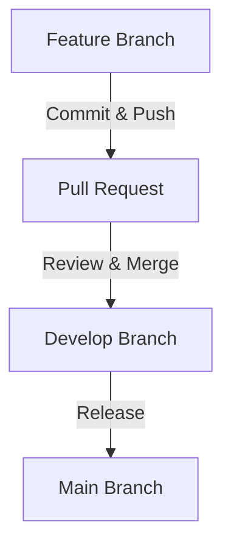

Before following this workflow please refer to our [**Getting Started**](./overview.md) page for instructions on installing dependencies and setting up your development environment.

# Contributor Workflow

## Overview

All changes should be made in a feature branch, merged into `develop`, and later merged into `main` for a new release.

## Contributing new changes

1. **Create a Feature Branch**
   - Branch from `develop` using `feature/<name>` or `bugfix/<name>`.
   - Example:

     ```shell
     git checkout develop
     git pull origin develop
     git checkout -b feature/new-feature
     ```

2. **Make Changes & Push**
   - Commit changes with clear messages.
   - Push the branch.

     ```shell
     git add .
     git commit -m "Description of changes"
     git push origin feature/new-feature
     ```

3. **Create a Pull Request**
   - Open a PR to merge into `develop`.
   - Address any review feedback.

4. **Merge & Clean Up**
   - After approval, merge into `develop`.
   - Delete the feature branch.

5. **Release**
   - When develop is clean and ready for a new major release, we will merge `develop` into `main`.

## Workflow Diagram



# Next Steps

Once you finish reading this it's recommended to check out the [architecture](./architecture.md) section.

