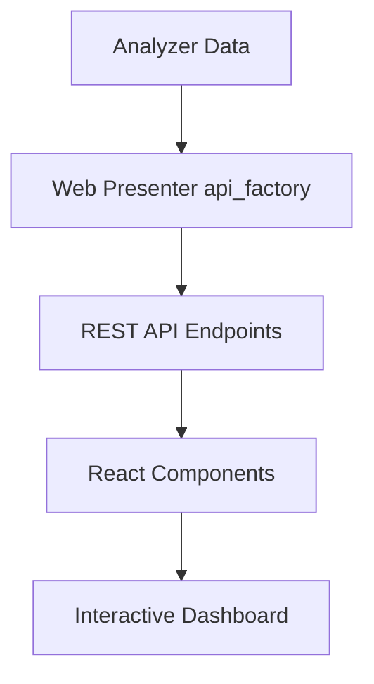

# React Dashboards Guide

Web presenters can create modern, client-side dashboards using React for rich interactivity and responsive user experiences. React dashboards consume data through REST APIs and provide smooth, app-like interfaces.

## Overview

React dashboards in this platform provide:

- **Client-side rendering**: Fast, responsive user interfaces
- **API-driven**: Clean separation between data and presentation
- **Modern UI components**: Built with shadcn/ui and Tailwind CSS
- **Rich visualizations**: Interactive charts with Deck.gl and Visx
- **Real-time interactions**: Immediate feedback and smooth animations

## Architecture

React dashboards follow a three-tier architecture:

1. **Web Presenter (Python)**: Implements `api_factory` to serve structured data via REST API
2. **API Layer**: Automatically generated endpoints that serve presenter data as JSON
3. **React Frontend**: TypeScript components that consume the API and render interactive UI



## Setting Up API Factory

The `api_factory` function transforms analyzer outputs into structured data for React consumption:

### Basic API Factory

```python
from typing import Optional, Any
from analyzer_interface.context import WebPresenterContext, FactoryOutputContext
from ..utils.pop import pop_unnecessary_fields

def api_factory(context: WebPresenterContext, options: Optional[dict[str, Any]] = None):
    """
    Transform analyzer data for React dashboard consumption.
    
    Args:
        context: Access to analyzer outputs and metadata
        options: Query parameters from API requests (filters, pagination, etc.)
    
    Returns:
        FactoryOutputContext with API-formatted data
    """
    # Extract API options
    filter_value = options.get("filter_value", "") if options else ""
    matcher = options.get("matcher", "") if options else ""
    
    # Load analyzer data
    df = pl.read_parquet(context.base.table("main_output").parquet_path)
    
    # Apply filtering based on API parameters
    if filter_value:
        df = df.filter(pl.col("category") == filter_value)
    
    if matcher:
        df = df.filter(pl.col("text_field").str.contains(matcher, literal=False))
    
    # Build presenter model with metadata
    presenter_model = context.web_presenter.model_dump()
    
    # Add visualization configuration
    presenter_model.update({
        "figure_type": "scatter",  # histogram, bar, scatter
        "axis": {
            "x": {"label": "User Count", "value": "user_count"},
            "y": {"label": "Message Count", "value": "message_count"}
        },
        "explanation": {
            "main_view": "This chart shows the relationship between users and messages..."
        }
    })
    
    # Add data arrays for visualization
    presenter_model["x"] = df["x_column"].to_list()
    presenter_model["y"] = df["y_column"].to_list()
    presenter_model["labels"] = df["label_column"].to_list()
    
    # Remove internal fields not needed by frontend
    return FactoryOutputContext(
        api=pop_unnecessary_fields(presenter_model)
    )
```

### Multi-Output API Factory

For analyzers with multiple data views:

```python
def api_factory(context: WebPresenterContext, options: Optional[dict[str, Any]] = None):
    # Determine which output to return
    output_type = options.get("output", "default") if options else "default"
    
    # Load different datasets
    df_summary = pl.read_parquet(
        context.base.table("summary_stats").parquet_path
    )
    df_details = pl.read_parquet(
        context.dependency(detail_analyzer).table("full_details").parquet_path
    )
    
    # Apply common filtering
    filter_value = options.get("filter_value", "") if options else ""
    if filter_value:
        df_summary = df_summary.filter(pl.col("category") == filter_value)
        df_details = df_details.filter(pl.col("category") == filter_value)
    
    # Create different presenter models for each output
    base_model = context.web_presenter.model_dump()
    
    summary_model = base_model.copy()
    summary_model.update({
        "figure_type": "scatter",
        "axis": {
            "x": {"label": "Users", "value": "user_count"},
            "y": {"label": "Messages", "value": "message_count"}
        },
        "x": df_summary["user_count"].to_list(),
        "y": df_summary["message_count"].to_list(),
        "labels": df_summary["category"].to_list()
    })
    
    details_model = base_model.copy()
    details_model.update({
        "figure_type": "table",
        "columns": ["user_id", "message_text", "timestamp", "category"],
        "data": df_details.to_dicts()
    })
    
    return FactoryOutputContext(
        api={
            "default_output": "summary",
            "summary": pop_unnecessary_fields(summary_model),
            "details": pop_unnecessary_fields(details_model)
        }
    )
```

### Complex Filtering and Search

```python
def api_factory(context: WebPresenterContext, options: Optional[dict[str, Any]] = None):
    # Load base data
    df = pl.read_parquet(context.base.table("ngram_analysis").parquet_path)
    
    # Extract search/filter parameters
    search_term = options.get("matcher", "") if options else ""
    date_range = options.get("date_range") if options else None
    min_frequency = options.get("min_frequency", 0) if options else 0
    
    # Apply filters progressively
    if search_term:
        # Create word matcher for ngram search
        search_filter = pl.col("ngram_text").str.contains(
            search_term.lower(), literal=False
        )
        df = df.filter(search_filter)
    
    if date_range:
        start_date, end_date = date_range.split(",")
        df = df.filter(
            pl.col("timestamp").is_between(
                pl.datetime(start_date), 
                pl.datetime(end_date)
            )
        )
    
    if min_frequency > 0:
        df = df.filter(pl.col("frequency") >= min_frequency)
    
    # Sort and limit results for performance
    df = df.sort("frequency", descending=True).head(1000)
    
    # Build API response
    presenter_model = context.web_presenter.model_dump()
    presenter_model.update({
        "figure_type": "scatter",
        "axis": {
            "x": {"label": "User Repetition", "value": "user_repetition"},
            "y": {"label": "Total Repetition", "value": "total_repetition"}
        },
        "explanation": {
            "total_repetition": "N-grams to the right are repeated by more users...",
            "user_repetition": "N-grams higher up show higher amplification..."
        },
        # Data for visualization
        "x": df["user_count"].to_list(),
        "y": df["total_count"].to_list(),
        "ngrams": df["ngram_text"].to_list(),
        "frequencies": df["frequency"].to_list(),
        "rankings": list(range(1, len(df) + 1))
    })
    
    return FactoryOutputContext(
        api=pop_unnecessary_fields(presenter_model)
    )
```

## API Endpoints

The API factory data is automatically exposed through these REST endpoints:

### Standard Endpoints

```bash
# List all presenters
GET /api/presenters

# Get specific presenter data  
GET /api/presenters/{presenter_id}

# Get specific output (for multi-output presenters)
GET /api/presenters/{presenter_id}?output=details

# Apply filters
GET /api/presenters/{presenter_id}?filter_field=category&filter_value=news

# Search/match text
GET /api/presenters/{presenter_id}?matcher=climate

# Combine parameters
GET /api/presenters/{presenter_id}?output=summary&matcher=election&min_frequency=5
```

### Download Endpoints

```bash
# Download as CSV
GET /api/presenters/{presenter_id}/download/csv

# Download as JSON
GET /api/presenters/{presenter_id}/download/json

# Download as Excel
GET /api/presenters/{presenter_id}/download/excel

# Download with filters applied
GET /api/presenters/{presenter_id}/download/csv?filter_value=news&matcher=climate 
```

## React Component Architecture

The React frontend is organized into reusable components that work together to create cohesive dashboards:

### Core Component Structure

```typescript
// Main presenter component
export default function NgramScatterPlot({ presenter }: ChartContainerProps<NgramPresenterStats>): ReactElement<FC> {
    const [searchValue, setSearchValue] = useState<string>('');
    const [selectedItem, setSelectedItem] = useState<string>('');
    const [currentTab, setCurrentTab] = useState<'total_repetition' | 'amplification_factor'>('total_repetition');
    
    // Data fetching and state management
    const { data, isLoading, error } = usePresenterData(presenter.id, {
        matcher: searchValue,
        output: currentTab
    });
    
    // Event handlers
    const handleSearch = (value: string) => setSearchValue(value);
    const handleItemSelect = (item: DataPoint) => setSelectedItem(item.id);
    const handleTabChange = (tab: string) => setCurrentTab(tab);
    
    return (
        <div className="space-y-6">
            {/* Controls */}
            <div className="flex justify-between items-center">
                <SearchBar onSubmit={handleSearch} onClear={() => setSearchValue('')} />
                <DownloadButton presenterID={presenter.id} />
            </div>
            
            {/* Tabs for different views */}
            <Tabs value={currentTab} onValueChange={handleTabChange}>
                <TabsList>
                    <TabsTrigger value="total_repetition">Total Repetition</TabsTrigger>
                    <TabsTrigger value="amplification_factor">Amplification</TabsTrigger>
                </TabsList>
                
                <TabsContent value="total_repetition">
                    <ScatterPlot 
                        data={data} 
                        onItemClick={handleItemSelect}
                        tooltip={createTooltipFormatter('total_repetition')} 
                    />
                </TabsContent>
                
                <TabsContent value="amplification_factor">
                    <ScatterPlot 
                        data={data} 
                        onItemClick={handleItemSelect}
                        tooltip={createTooltipFormatter('amplification_factor')} 
                    />
                </TabsContent>
            </Tabs>
            
            {/* Data table */}
            <DataTable 
                data={data}
                columns={tableColumns}
                onRowSelect={handleItemSelect}
                selectedRows={selectedItem ? [selectedItem] : []}
            />
        </div>
    );
}
```

### Data Fetching Hooks

Custom hooks manage API communication and state:

```typescript
// hooks/usePresenterData.ts
import { useState, useEffect } from 'react';
import { fetchPresenter } from '@/lib/data/presenters';

interface UsePresenterDataOptions {
    matcher?: string;
    output?: string;
    filter_field?: string;
    filter_value?: string;
    enabled?: boolean;
}

export function usePresenterData<T extends Presenter>(
    presenterId: string, 
    options: UsePresenterDataOptions = {}
) {
    const [data, setData] = useState<T | null>(null);
    const [isLoading, setIsLoading] = useState(false);
    const [error, setError] = useState<string | null>(null);
    
    useEffect(() => {
        if (!options.enabled && options.enabled !== undefined) return;
        
        const controller = new AbortController();
        
        const loadData = async () => {
            setIsLoading(true);
            setError(null);
            
            try {
                const result = await fetchPresenter(
                    presenterId, 
                    controller.signal, 
                    options
                );
                
                if (result) {
                    setData(result);
                } else {
                    setError('Failed to load data');
                }
            } catch (err) {
                if (!controller.signal.aborted) {
                    setError(err instanceof Error ? err.message : 'Unknown error');
                }
            } finally {
                setIsLoading(false);
            }
        };
        
        loadData();
        
        return () => controller.abort();
    }, [presenterId, options.matcher, options.output, options.filter_value, options.enabled]);
    
    return { data, isLoading, error };
}
```

### Chart Components

Interactive visualizations using Deck.gl:

```typescript
// components/charts/scatter.tsx
import { useMemo, useRef, useState } from 'react';
import { ScatterplotLayer } from '@deck.gl/layers';
import { COORDINATE_SYSTEM } from '@deck.gl/core';
import DeckGL from '@deck.gl/react';
import { AxisLeft, AxisBottom } from '@visx/axis';
import useChart from '@/lib/hooks/chart';

interface ScatterPlotProps {
    data: Array<DataPoint>;
    onItemClick?: (item: PickingInfo<DataPoint>) => void;
    tooltip: TooltipFunction<DataPoint>;
    darkMode?: boolean;
    dimensions?: Dimensions;
}

export default function ScatterPlot({
    data,
    onItemClick,
    tooltip,
    darkMode = false,
    dimensions = { width: 800, height: 600, margins: { top: 20, right: 40, bottom: 40, left: 60 }}
}: ScatterPlotProps) {
    const deckRef = useRef<DeckGLRef | null>(null);
    const [deckInstance, setDeckInstance] = useState<Deck | null>(null);
    
    // Custom hook handles coordinate transformation and scaling
    const { data: plotData, deckProps, axis, viewport } = useChart(
        data,
        tooltip,
        deckInstance,
        true, // resetZoomOnChange
        { x: { type: 'log', show: true }, y: { type: 'log', show: true } },
        dimensions
    );
    
    // Create Deck.gl layers
    const layers = useMemo(() => [
        new ScatterplotLayer({
            id: 'scatter-points',
            data: plotData,
            pickable: true,
            opacity: 0.8,
            stroked: false,
            filled: true,
            radiusScale: 6,
            radiusMinPixels: 2,
            radiusMaxPixels: 8,
            coordinateSystem: COORDINATE_SYSTEM.CARTESIAN,
            getPosition: (d: any) => d.position,
            getFillColor: (d: any) => d.color,
            updateTriggers: {
                getFillColor: [darkMode, viewport.viewState.zoom]
            },
            transitions: {
                getPosition: { duration: 300, type: 'spring' },
                getFillColor: { duration: 200 }
            }
        })
    ], [plotData, darkMode, viewport.viewState.zoom]);
    
    return (
        <div className="relative">
            {/* Zoom controls */}
            <div className="absolute top-4 right-4 z-10">
                <ToolBox 
                    features={['zoom', 'restore']}
                    zoomIncrement={viewport.hooks.increment}
                    zoomDecrement={viewport.hooks.decrement}
                    zoomReset={viewport.hooks.reset}
                />
            </div>
            
            {/* Main chart area */}
            <div style={{ position: 'relative', width: dimensions.width, height: dimensions.height }}>
                <DeckGL
                    ref={deckRef}
                    {...deckProps}
                    layers={layers}
                    onClick={onItemClick}
                    onAfterRender={() => {
                        if (deckRef.current?.deck && !deckInstance) {
                            setDeckInstance(deckRef.current.deck);
                        }
                    }}
                />
                
                {/* Axes overlay */}
                <svg width={dimensions.width} height={dimensions.height}>
                    <AxisBottom
                        scale={axis.x.scale}
                        top={dimensions.height - dimensions.margins.bottom}
                        tickLabelProps={{
                            fill: darkMode ? '#fff' : '#000',
                            fontSize: 10,
                            textAnchor: 'middle'
                        }}
                        stroke={darkMode ? '#fff' : '#000'}
                        tickStroke={darkMode ? '#fff' : '#000'}
                    />
                    <AxisLeft
                        scale={axis.y.scale}
                        left={dimensions.margins.left}
                        tickLabelProps={{
                            fill: darkMode ? '#fff' : '#000',
                            fontSize: 10,
                            textAnchor: 'end'
                        }}
                        stroke={darkMode ? '#fff' : '#000'}
                        tickStroke={darkMode ? '#fff' : '#000'}
                    />
                </svg>
            </div>
        </div>
    );
}
```

### Interactive Data Tables

Rich data tables with selection and filtering:

```typescript
// components/data_table.tsx
import { useMemo, useCallback, useState, useEffect } from 'react';
import { DataEditor, GridCellKind, CompactSelection } from '@glideapps/glide-data-grid';

interface DataTableProps<T extends BaseRow> {
    data: Array<T>;
    columns: Array<GridColumn>;
    onRowSelect?: (item: T | null, selection?: GridSelection) => void;
    selectedRows?: CompactSelection;
    darkMode?: boolean;
    theme?: Partial<Theme>;
}

export default function DataTable<T extends BaseRow>({
    data,
    columns,
    onRowSelect,
    selectedRows,
    darkMode = false,
    theme
}: DataTableProps<T>) {
    const [gridSelection, setGridSelection] = useState<GridSelection>({
        columns: CompactSelection.empty(),
        rows: selectedRows ?? CompactSelection.empty()
    });
    
    // Column mapping for data access
    const columnIds = useMemo(() => 
        columns.map(col => col.id).filter(Boolean) as string[]
    , [columns]);
    
    // Cell content renderer
    const getCellContent = useCallback(([col, row]: Item): GridCell => {
        const item = data[row];
        const columnId = columnIds[col];
        const value = item[columnId];
        
        // Determine cell type based on value
        let cellType = GridCellKind.Text;
        if (typeof value === 'number') cellType = GridCellKind.Number;
        if (typeof value === 'boolean') cellType = GridCellKind.Boolean;
        
        return {
            kind: cellType,
            allowOverlay: false,
            displayData: String(value ?? ''),
            data: value
        };
    }, [data, columnIds]);
    
    // Selection handler
    const handleSelectionChange = useCallback((selection: GridSelection) => {
        setGridSelection(selection);
        
        const selectedRow = selection.rows.first();
        const item = selectedRow !== undefined ? data[selectedRow] : null;
        
        onRowSelect?.(item, selection);
    }, [data, onRowSelect]);
    
    // Theme configuration
    const tableTheme = useMemo(() => {
        if (theme) return theme;
        
        return darkMode ? {
            accentColor: '#8c96ff',
            textDark: '#ffffff',
            textMedium: '#b8b8b8',
            bgCell: '#16161b',
            bgHeader: '#212121',
            borderColor: 'rgba(225,225,225,0.2)',
            fontFamily: 'Inter, sans-serif'
        } : {};
    }, [darkMode, theme]);
    
    // Sync external selection changes
    useEffect(() => {
        if (selectedRows && !selectedRows.equals(gridSelection.rows)) {
            setGridSelection(prev => ({ ...prev, rows: selectedRows }));
        }
    }, [selectedRows]);
    
    return (
        <DataEditor
            width="100%"
            height="50rem"
            className="rounded-md border shadow-md"
            columns={columns}
            rows={data.length}
            getCellContent={getCellContent}
            gridSelection={gridSelection}
            onGridSelectionChange={handleSelectionChange}
            theme={tableTheme}
            rowSelect="single"
            rowMarkers="checkbox-visible"
        />
    );
}
```

### Search and Filtering Components

Reusable search components with autocomplete:

```typescript
// components/search.tsx
import { useState, useEffect, useMemo } from 'react';
import { useVirtualizer } from '@tanstack/react-virtual';
import { Input } from '@/components/ui/input';
import { Button } from '@/components/ui/button';
import { X } from 'lucide-react';

interface SearchBarProps {
    searchList: Array<string>;
    onSubmit: (value: string) => void;
    onClear?: () => void;
    placeholder?: string;
    maxSuggestions?: number;
}

export default function SearchBar({ 
    searchList, 
    onSubmit, 
    onClear, 
    placeholder = "Search...",
    maxSuggestions = 100
}: SearchBarProps) {
    const [value, setValue] = useState('');
    const [showSuggestions, setShowSuggestions] = useState(false);
    const containerRef = useRef<HTMLDivElement>(null);
    
    // Filter suggestions based on input
    const suggestions = useMemo(() => {
        if (!value) return [];
        
        return searchList
            .filter(item => item.toLowerCase().includes(value.toLowerCase()))
            .slice(0, maxSuggestions);
    }, [value, searchList, maxSuggestions]);
    
    // Virtual scrolling for large suggestion lists
    const virtualizer = useVirtualizer({
        count: suggestions.length,
        getScrollElement: () => containerRef.current,
        estimateSize: () => 35
    });
    
    const handleSubmit = (e: FormEvent) => {
        e.preventDefault();
        onSubmit(value);
        setShowSuggestions(false);
    };
    
    const handleSuggestionClick = (suggestion: string) => {
        setValue(suggestion);
        onSubmit(suggestion);
        setShowSuggestions(false);
    };
    
    const handleClear = () => {
        setValue('');
        onClear?.();
    };
    
    // Show/hide suggestions based on focus and value
    useEffect(() => {
        setShowSuggestions(suggestions.length > 0 && value.length > 0);
    }, [suggestions.length, value.length]);
    
    return (
        <form onSubmit={handleSubmit} className="relative">
            <div className="flex items-center space-x-2">
                <Input
                    type="text"
                    value={value}
                    onChange={(e) => setValue(e.target.value)}
                    placeholder={placeholder}
                    className="w-80"
                    onFocus={() => suggestions.length > 0 && setShowSuggestions(true)}
                    onBlur={() => setTimeout(() => setShowSuggestions(false), 150)}
                />
                {value && (
                    <Button
                        type="button"
                        variant="ghost"
                        size="icon"
                        onClick={handleClear}
                    >
                        <X className="h-4 w-4" />
                    </Button>
                )}
            </div>
            
            {/* Suggestions dropdown */}
            {showSuggestions && (
                <div
                    ref={containerRef}
                    className="absolute z-50 w-80 max-h-96 mt-1 bg-white border rounded-md shadow-lg overflow-auto dark:bg-zinc-950 dark:border-zinc-800"
                >
                    <div
                        style={{ height: virtualizer.getTotalSize() }}
                        className="relative"
                    >
                        {virtualizer.getVirtualItems().map((item) => (
                            <div
                                key={item.key}
                                className="absolute w-full px-3 py-2 cursor-pointer hover:bg-zinc-100 dark:hover:bg-zinc-800"
                                style={{
                                    height: item.size,
                                    transform: `translateY(${item.start}px)`
                                }}
                                onMouseDown={() => handleSuggestionClick(suggestions[item.index])}
                            >
                                {suggestions[item.index]}
                            </div>
                        ))}
                    </div>
                </div>
            )}
        </form>
    );
}
```

### Download Components

Export functionality for data:

```typescript
// components/download.tsx
import { useState } from 'react';
import { Button } from '@/components/ui/button';
import { DropdownMenu, DropdownMenuContent, DropdownMenuItem, DropdownMenuTrigger } from '@/components/ui/dropdown-menu';
import { Sheet, Braces, Table, ChevronDown } from 'lucide-react';
import { createDownloadLink } from '@/lib/data/download';

interface DownloadButtonProps {
    presenterID: string;
    queryParams?: PresenterQueryParams;
    label?: string;
}

export function DownloadButton({ 
    presenterID, 
    queryParams, 
    label = "Export" 
}: DownloadButtonProps) {
    const [isOpen, setIsOpen] = useState(false);
    
    const downloadFormats = [
        { type: 'excel', icon: Sheet, label: 'Excel', extension: '.xlsx' },
        { type: 'csv', icon: Table, label: 'CSV', extension: '.csv' },
        { type: 'json', icon: Braces, label: 'JSON', extension: '.json' }
    ] as const;
    
    return (
        <DropdownMenu open={isOpen} onOpenChange={setIsOpen}>
            <DropdownMenuTrigger asChild>
                <Button variant="outline" size="sm">
                    {label}
                    <ChevronDown className={`ml-2 h-4 w-4 transition-transform ${isOpen ? 'rotate-180' : ''}`} />
                </Button>
            </DropdownMenuTrigger>
            
            <DropdownMenuContent align="end">
                {downloadFormats.map(({ type, icon: Icon, label: formatLabel }) => (
                    <DropdownMenuItem key={type} asChild>
                        <a
                            href={createDownloadLink(presenterID, type, queryParams)}
                            target="_blank"
                            rel="noopener noreferrer"
                            className="flex items-center w-full"
                        >
                            <Icon className="mr-2 h-4 w-4" />
                            {formatLabel}
                        </a>
                    </DropdownMenuItem>
                ))}
            </DropdownMenuContent>
        </DropdownMenu>
    );
}
```

## State Management

### Local Component State

For simple interactions, use React's built-in state:

```typescript
function NgramDashboard({ presenter }: DashboardProps) {
    // UI state
    const [searchTerm, setSearchTerm] = useState('');
    const [selectedTab, setSelectedTab] = useState<TabType>('overview');
    const [selectedItems, setSelectedItems] = useState<string[]>([]);
    
    // Data state with custom hook
    const { data, isLoading, error } = usePresenterData(presenter.id, {
        matcher: searchTerm,
        output: selectedTab
    });
    
    // Derived state
    const filteredData = useMemo(() => {
        if (!data || !searchTerm) return data;
        return data.filter(item => 
            item.text.toLowerCase().includes(searchTerm.toLowerCase())
        );
    }, [data, searchTerm]);
    
    // Event handlers
    const handleSearch = useCallback((term: string) => {
        setSearchTerm(term);
        setSelectedItems([]); // Clear selection on new search
    }, []);
    
    return (
        // Component JSX
    );
}
```

### Global State with Zustand

For complex dashboards with shared state:

```typescript
// stores/dashboardStore.ts
import { create } from 'zustand';

interface DashboardState {
    // Data
    presenters: PresenterCollection;
    currentPresenter: Presenter | null;
    
    // UI state
    sidebarOpen: boolean;
    theme: 'light' | 'dark' | 'system';
    
    // Filters
    globalFilters: {
        dateRange?: [Date, Date];
        categories: string[];
        searchTerm: string;
    };
    
    // Actions
    setCurrentPresenter: (presenter: Presenter) => void;
    updateFilters: (filters: Partial<DashboardState['globalFilters']>) => void;
    toggleSidebar: () => void;
}

export const useDashboardStore = create<DashboardState>((set, get) => ({
    presenters: [],
    currentPresenter: null,
    sidebarOpen: true,
    theme: 'system',
    globalFilters: {
        categories: [],
        searchTerm: ''
    },
    
    setCurrentPresenter: (presenter) => set({ currentPresenter: presenter }),
    
    updateFilters: (newFilters) => set(state => ({
        globalFilters: { ...state.globalFilters, ...newFilters }
    })),
    
    toggleSidebar: () => set(state => ({ sidebarOpen: !state.sidebarOpen }))
}));

// Usage in components
function Dashboard() {
    const { currentPresenter, globalFilters, updateFilters } = useDashboardStore();
    
    const handleSearch = (searchTerm: string) => {
        updateFilters({ searchTerm });
    };
    
    return (
        // Dashboard JSX
    );
}
```

## Styling and Theming

### Tailwind CSS Classes

The project uses Tailwind CSS for utility-first styling:

```typescript
// Layout utilities
<div className="grid grid-cols-1 md:grid-cols-2 lg:grid-cols-3 gap-6">
    <div className="col-span-full lg:col-span-2">
        {/* Main content */}
    </div>
    <div className="lg:col-span-1">
        {/* Sidebar */}
    </div>
</div>

// Component styling
<Card className="p-6 shadow-lg border-zinc-200 dark:border-zinc-800">
    <CardHeader className="pb-4">
        <CardTitle className="text-lg font-semibold text-zinc-900 dark:text-zinc-100">
            Chart Title
        </CardTitle>
    </CardHeader>
    <CardContent>
        {/* Chart content */}
    </CardContent>
</Card>

// Interactive states
<Button 
    variant="outline" 
    className="hover:bg-zinc-100 dark:hover:bg-zinc-800 transition-colors"
    disabled={isLoading}
>
    {isLoading ? <Spinner className="mr-2" /> : null}
    Load Data
</Button>
```

### Dark Mode Support

Dark mode is handled through CSS custom properties and Tailwind's dark variant:

```typescript
// Theme provider context
export function ThemeProvider({ children, defaultTheme = "system" }) {
    const [theme, setTheme] = useState<Theme>(defaultTheme);
    
    useEffect(() => {
        const root = window.document.documentElement;
        root.classList.remove("light", "dark");
        
        if (theme === "system") {
            const systemTheme = window.matchMedia("(prefers-color-scheme: dark)").matches 
                ? "dark" : "light";
            root.classList.add(systemTheme);
        } else {
            root.classList.add(theme);
        }
    }, [theme]);
    
    return (
        <ThemeContext.Provider value={{ theme, setTheme }}>
            {children}
        </ThemeContext.Provider>
    );
}

// Usage in components
function Chart({ data }: ChartProps) {
    const { theme } = useTheme();
    const isDark = theme === 'dark' || 
        (theme === 'system' && window.matchMedia('(prefers-color-scheme: dark)').matches);
    
    return (
        <ScatterPlot 
            data={data}
            darkMode={isDark}
            // Colors adapt automatically through Tailwind dark: variants
        />
    );
}
```

### Responsive Design

Components adapt to different screen sizes:

```typescript
<div className="space-y-6">
    {/* Mobile-first responsive grid */}
    <div className="grid grid-cols-1 lg:grid-cols-4 gap-4">
        <div className="lg:col-span-3">
            {/* Chart takes full width on mobile, 3/4 on desktop */}
            <ScatterPlot data={data} />
        </div>
        <div className="lg:col-span-1">
            {/* Controls stack below chart on mobile, sidebar on desktop */}
            <div className="space-y-4">
                <SearchBar onSubmit={handleSearch} />
                <FilterControls />
            </div>
        </div>
    </div>
    
    {/* Table with horizontal scroll on mobile */}
    <div className="overflow-x-auto">
        <DataTable 
            data={data}
            className="min-w-[600px]" 
        />
    </div>
</div>
```

## Performance Optimization

### Memoization and Optimization

```typescript
// Memoize expensive calculations
const processedData = useMemo(() => {
    if (!rawData) return [];
    
    return rawData
        .filter(item => item.value > threshold)
        .sort((a, b) => b.value - a.value)
        .slice(0, maxItems);
}, [rawData, threshold, maxItems]);

// Memoize callback functions
const handleItemClick = useCallback((item: DataPoint) => {
    setSelectedItem(item);
    onItemSelect?.(item);
}, [onItemSelect]);

// Memoize complex components
const ChartComponent = memo(({ data, options }: ChartProps) => {
    return <ExpensiveChart data={data} options={options} />;
});
```

### Virtual Scrolling

For large datasets, implement virtual scrolling:

```typescript
import { useVirtualizer } from '@tanstack/react-virtual';

function VirtualTable({ data }: { data: Array<any> }) {
    const containerRef = useRef<HTMLDivElement>(null);
    
    const virtualizer = useVirtualizer({
        count: data.length,
        getScrollElement: () => containerRef.current,
        estimateSize: () => 50, // Row height
        overscan: 10 // Render extra items for smooth scrolling
    });
    
    return (
        <div ref={containerRef} className="h-96 overflow-auto">
            <div style={{ height: virtualizer.getTotalSize() }}>
                {virtualizer.getVirtualItems().map((item) => (
                    <div
                        key={item.key}
                        style={{
                            position: 'absolute',
                            top: 0,
                            left: 0,
                            width: '100%',
                            height: item.size,
                            transform: `translateY(${item.start}px)`
                        }}
                    >
                        <TableRow data={data[item.index]} />
                    </div>
                ))}
            </div>
        </div>
    );
}
```

### Code Splitting

Split large components with lazy loading:

```typescript
// Lazy load heavy visualization components
const AdvancedChart = lazy(() => import('@/components/charts/advanced-chart'));
const ComplexTable = lazy(() => import('@/components/tables/complex-table'));

function Dashboard() {
    return (
        <Suspense fallback={<div>Loading chart...</div>}>
            <AdvancedChart data={data} />
        </Suspense>
    );
}
```

## Testing React Dashboards

### Component Testing

```typescript
// __tests__/components/SearchBar.test.tsx
import { render, screen, fireEvent, waitFor } from '@testing-library/react';
import userEvent from '@testing-library/user-event';
import SearchBar from '@/components/search';

describe('SearchBar', () => {
    const mockSubmit = jest.fn();
    const mockClear = jest.fn();
    const searchList = ['apple', 'banana', 'cherry', 'date'];
    
    beforeEach(() => {
        jest.clearAllMocks();
    });
    
    test('renders with placeholder', () => {
        render(
            <SearchBar 
                searchList={searchList}
                onSubmit={mockSubmit}
                placeholder="Search fruits..."
            />
        );
        
        expect(screen.getByPlaceholderText('Search fruits...')).toBeInTheDocument();
    });
    
    test('shows suggestions when typing', async () => {
        const user = userEvent.setup();
        
        render(
            <SearchBar searchList={searchList} onSubmit={mockSubmit} />
        );
        
        const input = screen.getByRole('textbox');
        await user.type(input, 'a');
        
        await waitFor(() => {
            expect(screen.getByText('apple')).toBeInTheDocument();
            expect(screen.getByText('banana')).toBeInTheDocument();
        });
    });
    
    test('calls onSubmit when form submitted', async () => {
        const user = userEvent.setup();
        
        render(
            <SearchBar searchList={searchList} onSubmit={mockSubmit} />
        );
        
        const input = screen.getByRole('textbox');
        await user.type(input, 'apple');
        await user.keyboard('{Enter}');
        
        expect(mockSubmit).toHaveBeenCalledWith('apple');
    });
});
```

### Integration Testing

```typescript
// __tests__/integration/Dashboard.test.tsx
import { render, screen, waitFor } from '@testing-library/react';
import { rest } from 'msw';
import { setupServer } from 'msw/node';
import Dashboard from '@/components/dashboard';

// Mock API server
const server = setupServer(
    rest.get('/api/presenters/:id', (req, res, ctx) => {
        return res(ctx.json({
            id: 'test-presenter',
            name: 'Test Presenter',
            data: [
                { x: 1, y: 2, label: 'Point 1' },
                { x: 3, y: 4, label: 'Point 2' }
            ]
        }));
    })
);

beforeAll(() => server.listen());
afterEach(() => server.resetHandlers());
afterAll(() => server.close());

test('loads and displays data', async () => {
    render(<Dashboard presenterId="test-presenter" />);
    
    // Initially shows loading
    expect(screen.getByText(/loading/i)).toBeInTheDocument();
    
    // After API call, shows data
    await waitFor(() => {
        expect(screen.getByText('Test Presenter')).toBeInTheDocument();
    });
    
    // Chart renders with data points
    expect(screen.getByText('Point 1')).toBeInTheDocument();
    expect(screen.getByText('Point 2')).toBeInTheDocument();
});

test('handles API errors gracefully', async () => {
    server.use(
        rest.get('/api/presenters/:id', (req, res, ctx) => {
            return res(ctx.status(500), ctx.json({ error: 'Server error' }));
        })
    );
    
    render(<Dashboard presenterId="test-presenter" />);
    
    await waitFor(() => {
        expect(screen.getByText(/error loading data/i)).toBeInTheDocument();
    });
});
```

### E2E Testing with Cypress

```typescript
// cypress/integration/dashboard.spec.ts
describe('Dashboard Interaction', () => {
    beforeEach(() => {
        cy.intercept('GET', '/api/presenters/ngram-analysis', { 
            fixture: 'ngram-data.json' 
        }).as('getNgramData');
        
        cy.visit('/dashboard/ngram-analysis');
        cy.wait('@getNgramData');
    });
    
    it('allows searching and filtering data', () => {
        // Search for specific terms
        cy.get('[data-testid="search-input"]').type('climate');
        cy.get('[data-testid="search-submit"]').click();
        
        // Verify results update
        cy.get('[data-testid="chart-points"]').should('have.length.lessThan', 100);
        cy.get('[data-testid="data-table"]').should('contain', 'climate');
        
        // Clear search
        cy.get('[data-testid="search-clear"]').click();
        cy.get('[data-testid="chart-points"]').should('have.length.greaterThan', 100);
    });
    
    it('supports chart interactions', () => {
        // Click on chart point
        cy.get('[data-testid="chart-container"]').click(300, 200);
        
        // Verify tooltip appears
        cy.get('[data-testid="tooltip"]').should('be.visible');
        cy.get('[data-testid="tooltip"]').should('contain', 'Ranking:');
        
        // Verify data table selection updates
        cy.get('[data-testid="data-table"] .selected-row').should('exist');
    });
    
    it('downloads data in different formats', () => {
        // Open download menu
        cy.get('[data-testid="download-button"]').click();
        
        // Download CSV
        cy.get('[data-testid="download-csv"]').click();
        cy.readFile('cypress/downloads/data.csv').should('exist');
        
        // Download JSON
        cy.get('[data-testid="download-button"]').click();
        cy.get('[data-testid="download-json"]').click();
        cy.readFile('cypress/downloads/data.json').should('exist');
    });
});
```

## Deployment and Build Process

### Production Build

The React dashboard builds as static assets:

```bash
# Build for production
npm run build

# Outputs to app/web_templates/build/
# - bundled/ (JS/CSS assets)
# - manifest.json (asset mapping)
```

### Integration with Backend

The Python backend serves the React app:

```python
# Backend integration
from pathlib import Path
import json

# Load build manifest
manifest_path = Path("web_templates/build/manifest.json")
with open(manifest_path) as f:
    manifest = json.load(f)

# Serve React app
@app.route("/")
def dashboard():
    return render_template(
        "index.html",
        js_files=get_js_files(manifest),
        css_files=get_css_files(manifest),
        project_name=config.PROJECT_NAME
    )
```

### Environment Configuration

```typescript
// Environment variables for different deployments
const config = {
    API_BASE_URL: process.env.REACT_APP_API_URL || 'http://localhost:8050',
    ENABLE_DEV_TOOLS: process.env.NODE_ENV === 'development',
    VERSION: process.env.REACT_APP_VERSION || '1.0.0'
};

// API client configuration
const apiClient = axios.create({
    baseURL: config.API_BASE_URL,
    timeout: 30000,
    headers: {
        'Content-Type': 'application/json'
    }
});
```

## Best Practices

### Component Design

```typescript
// 1. Keep components focused and single-purpose
function ChartControls({ onFilterChange, onExport }: ChartControlsProps): ReactElement<FC> {
    // Only handle UI controls, delegate data management
    return (
        <div className="flex gap-4">
            <SearchBar onSubmit={(term) => onFilterChange({ search: term })} />
            <ExportButton onExport={onExport} />
        </div>
    );
}

// 2. Use composition over inheritance
function Dashboard({ children }: PropsWithChildren): ReactElement<FC> {
    return (
        <div className="dashboard-layout">
            <Sidebar />
            <main className="main-content">
                {children}
            </main>
        </div>
    );
}

// Usage
<Dashboard>
    <ChartContainer>
        <ScatterPlot data={data} />
        <DataTable data={data} />
    </ChartContainer>
</Dashboard>

// 3. Extract custom hooks for reusable logic
function useChartData(presenterId: string, filters: Filters) {
    const [data, setData] = useState(null);
    const [isLoading, setIsLoading] = useState(false);
    
    useEffect(() => {
        // Data fetching logic
    }, [presenterId, filters]);
    
    return { data, isLoading, refetch: () => setData(null) };
}
```

## Complete Example: Ngram Analysis Dashboard

Here's a complete example showing all concepts together:

```typescript
// components/ngram-dashboard.tsx
import { useState, useEffect, useMemo, useCallback } from 'react';
import { useTheme } from '@/components/theme-provider';
import { Tabs, TabsContent, TabsList, TabsTrigger } from '@/components/ui/tabs';
import { Card, CardContent, CardHeader, CardTitle } from '@/components/ui/card';
import { Info } from 'lucide-react';
import { Tooltip, TooltipContent, TooltipTrigger } from '@/components/ui/tooltip';

import ScatterPlot from '@/components/charts/scatter';
import DataTable from '@/components/data-table';
import SearchBar from '@/components/search';
import { DownloadButton } from '@/components/download';
import { usePresenterData } from '@/hooks/usePresenterData';

interface NgramDashboardProps {
    presenter: NgramPresenter;
}

export default function NgramDashboard({ presenter }: NgramDashboardProps) {
    // State management
    const [searchTerm, setSearchTerm] = useState('');
    const [selectedNgram, setSelectedNgram] = useState('');
    const [currentTab, setCurrentTab] = useState<'total_repetition' | 'amplification_factor'>('total_repetition');
    const [selectedRows, setSelectedRows] = useState<CompactSelection>(CompactSelection.empty());
    
    // Theme
    const { theme } = useTheme();
    const isDark = theme === 'dark' || 
        (theme === 'system' && window.matchMedia('(prefers-color-scheme: dark)').matches);
    
    // Data fetching
    const { data: summaryData, isLoading } = usePresenterData(presenter.id, {
        output: 'summary',
        matcher: searchTerm
    });
    
    const { data: detailData } = usePresenterData(presenter.id, {
        output: 'details',
        filter_field: 'ngram',
        filter_value: selectedNgram
    }, { enabled: !!selectedNgram });
    
    // Computed values
    const currentData = useMemo(() => {
        if (!summaryData) return [];
        
        return summaryData.map((item, index) => ({
            ...item,
            ranking: index + 1,
            y: currentTab === 'total_repetition' 
                ? item.total_repetition 
                : item.amplification_factor
        }));
    }, [summaryData, currentTab]);
    
    const tableColumns = useMemo(() => {
        if (selectedNgram && detailData) {
            return [
                { id: 'ngram', title: 'N-gram', width: 200 },
                { id: 'user', title: 'User', width: 150 },
                { id: 'userReps', title: 'User Reps', width: 100 },
                { id: 'message', title: 'Message', width: 400 },
                { id: 'timestamp', title: 'Timestamp', width: 200 }
            ];
        }
        
        return [
            { id: 'ranking', title: 'Rank', width: 80 },
            { id: 'ngram', title: 'N-gram', width: 300 },
            { id: 'x', title: 'User Count', width: 120 },
            { 
                id: 'y', 
                title: currentTab === 'total_repetition' ? 'Total Reps' : 'Amplification',
                width: 120 
            }
        ];
    }, [selectedNgram, detailData, currentTab]);
    
    // Event handlers
    const handleSearch = useCallback((term: string) => {
        setSearchTerm(term);
        setSelectedNgram(''); // Clear selection when searching
    }, []);
    
    const handleSearchClear = useCallback(() => {
        setSearchTerm('');
        setSelectedNgram('');
    }, []);
    
    const handleChartClick = useCallback((info: PickingInfo<DataPoint>) => {
        if (info.object) {
            setSelectedNgram(info.object.ngram);
        }
    }, []);
    
    const handleTableSelect = useCallback((item: DataPoint | null, selection?: GridSelection) => {
        if (item) {
            setSelectedNgram(item.ngram);
        }
        if (selection) {
            setSelectedRows(selection.rows);
        }
    }, []);
    
    const handleTabChange = useCallback((tab: string) => {
        setCurrentTab(tab as typeof currentTab);
    }, []);
    
    // Tooltip formatters
    const createTooltipFormatter = useCallback((type: string) => (params: DataPoint) => `
        <div class="space-y-2">
            <div class="font-bold">${params.ngram}</div>
            <div>Ranking: ${params.ranking}</div>
            <div>User Count: ${params.x}</div>
            <div>${type === 'total_repetition' ? 'Total Reps' : 'Amplification'}: ${params.y}</div>
        </div>
    `, []);
    
    // Loading state
    if (isLoading) {
        return (
            <Card>
                <CardContent className="flex items-center justify-center h-96">
                    <div className="text-center">
                        <div className="animate-spin rounded-full h-12 w-12 border-b-2 border-blue-600 mx-auto mb-4"></div>
                        <p>Loading dashboard...</p>
                    </div>
                </CardContent>
            </Card>
        );
    }
    
    return (
        <Card>
            <CardContent className="space-y-6">
                <Tabs value={currentTab} onValueChange={handleTabChange}>
                    <div className="flex items-center justify-between">
                        <TabsList>
                            <TabsTrigger value="total_repetition">Total Repetition</TabsTrigger>
                            <TabsTrigger value="amplification_factor">Amplification Factor</TabsTrigger>
                        </TabsList>
                        
                        <Tooltip>
                            <TooltipTrigger>
                                <Info className="h-5 w-5 text-zinc-500" />
                            </TooltipTrigger>
                            <TooltipContent>
                                <p className="max-w-xs">
                                    {presenter.explanation[currentTab]}
                                </p>
                            </TooltipContent>
                        </Tooltip>
                    </div>
                    
                    <TabsContent value="total_repetition" className="space-y-6">
                        <div className="flex items-center justify-between">
                            <SearchBar
                                searchList={presenter.ngrams}
                                onSubmit={handleSearch}
                                onClear={handleSearchClear}
                                placeholder="Search n-grams..."
                            />
                            <DownloadButton 
                                presenterID={presenter.id}
                                queryParams={{ 
                                    output: 'summary',
                                    matcher: searchTerm || undefined 
                                }}
                            />
                        </div>
                        
                        <ScatterPlot
                            data={currentData}
                            darkMode={isDark}
                            onClick={handleChartClick}
                            tooltip={createTooltipFormatter('total_repetition')}
                            axis={{
                                x: { type: 'log', show: true },
                                y: { type: 'log', show: true }
                            }}
                        />
                        
                        <DataTable
                            data={selectedNgram && detailData ? detailData : currentData}
                            columns={tableColumns}
                            onRowSelect={handleTableSelect}
                            selectedRows={selectedRows}
                            darkMode={isDark}
                        />
                    </TabsContent>
                    
                    <TabsContent value="amplification_factor" className="space-y-6">
                        <div className="flex items-center justify-between">
                            <SearchBar
                                searchList={presenter.ngrams}
                                onSubmit={handleSearch}
                                onClear={handleSearchClear}
                                placeholder="Search n-grams..."
                            />
                            <DownloadButton 
                                presenterID={presenter.id}
                                queryParams={{ 
                                    output: 'summary',
                                    matcher: searchTerm || undefined 
                                }}
                            />
                        </div>
                        
                        <ScatterPlot
                            data={currentData}
                            darkMode={isDark}
                            onClick={handleChartClick}
                            tooltip={createTooltipFormatter('amplification_factor')}
                            axis={{
                                x: { type: 'log', show: true },
                                y: { type: 'log', show: true }
                            }}
                        />
                        
                        <DataTable
                            data={selectedNgram && detailData ? detailData : currentData}
                            columns={tableColumns}
                            onRowSelect={handleTableSelect}
                            selectedRows={selectedRows}
                            darkMode={isDark}
                        />
                    </TabsContent>
                </Tabs>
            </CardContent>
        </Card>
    );
}
```

This comprehensive guide covers all aspects of building React dashboards for the analyzer platform. The combination of TypeScript, modern React patterns, rich UI components, and seamless API integration creates powerful, user-friendly data analysis interfaces that complement the Python-based analyzer pipeline.

# Next Steps

After this section it would be a good idea to review the sections that discuss implementing  [Shiny](https://shiny.posit.co/py/) dashboards. Although once you finish reading this it would also be a good idea to review the sections for each domain.

- [Core Domain](../domains/core-domain.md)
- [Edge Domain](../domains/edge-domain.md)
- [Content Domain](../domains/content-domain.md)
- [Shiny Dashboards](./shiny.md)


