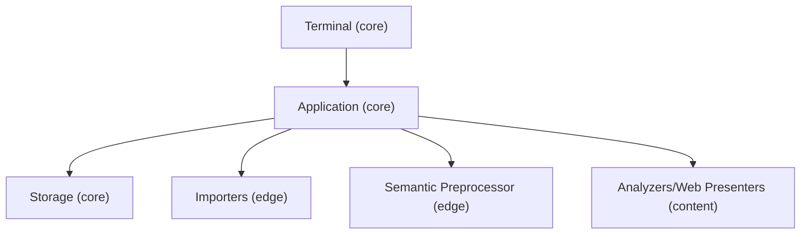

Before contributing please refer to our [**Contributor Workflow**](./contributing.md)

## Application Design Overview
The CIB 🥭 application is a terminal-based tool for performing data analysis and visualization. It is designed to be modular and extensible, allowing developers to contribute new analysis modules and visualization components while providing a consistent user experience around data import, preprocessing, and output generation.

This design is motivated by a common pain point when moving from a data analysis script for private use to a tool that can be shared with others: A script for private consumption carries assumptions about the desired input and output data format and structure that are convenient to its author. When such a script is made available to others, debates on these aspects often arise. For a suite of analyses that this project aims to offer, if left decentralized, this debate can lead to inconsistent UX offerings across analyses, code duplication, and even bugs.

The architecture of the CIB 🥭 application is designed to address this problem by providing a clear separation between the core application logic and the analysis modules, such that the analysis module does not need to be concerned with the input and output data format and structure; such responsibilities are handled by the core application, where we aim to provide a rich, consistent, and intuitive user experience.

## Architecture Overview

The application has three "domains":
- The [**Core**](../domains/core-domain.md) domain is responsible for workspace management, user flow, and integration of analysis runs and data import/export in a generic sense. It has three parts that correspond loosely to the MVC paradigm.
  - The **Application** defines the workspace logic and exposes generic capabilities for importing and exporting data as well as analyses and dashboards. This is the "controller" part.
  - The **Terminal** Components render the terminal interface and handle user input. This is the "view" part.
  - The **Storage IO** persists the workspace data and is responsible for reading and writing data. This is the "model" part.

  The core application provides the context necessary for the other domains to function in a way that allows them to be agnostic about the specifics of the workspace and user flow.

- The [**Edge**](../domains/edge-domain.md) domain is responsible for data import and export while being agnostic about the specific analysis being run. Currently, this consists of the **Importers** and the **Semantic Preprocessor**.

  > Note that the Storage IO is currently responsible for data export, but we should consider moving this to the Edge domain to allow for more extensibility and looser coupling.

- The [**Content**](../domains/content-domain.md) domain is responsible for the actual data analysis and visualization and is agnostic about data import/export or workspace specifics. This consists of the **Analyzers** (both **Primary** and **Secondary**) as well as the **Web Presenters**.

# Questions, Comments, and Feedback

Talk to us on the [Civic Tech DC Slack workspace](https://civictechdc.slack.com)!

# Next Steps

It would be recommended to review the sections for each domain, and the section for implementing analyzers. Might also be a good idea to review the sections that discuss implementing  [Shiny](https://shiny.posit.co/py/), and [React](https://react.dev) dashboards.

- [Core Domain](../domains/core-domain.md)
- [Edge Domain](../domains/edge-domain.md)
- [Content Domain](../domains/content-domain.md)
- [Implementing Analyzers](../analyzers.md)
- [Shiny Dashboards](../dashboards/shiny.md)
- [React Dashboards](../dashboards/react.md)

